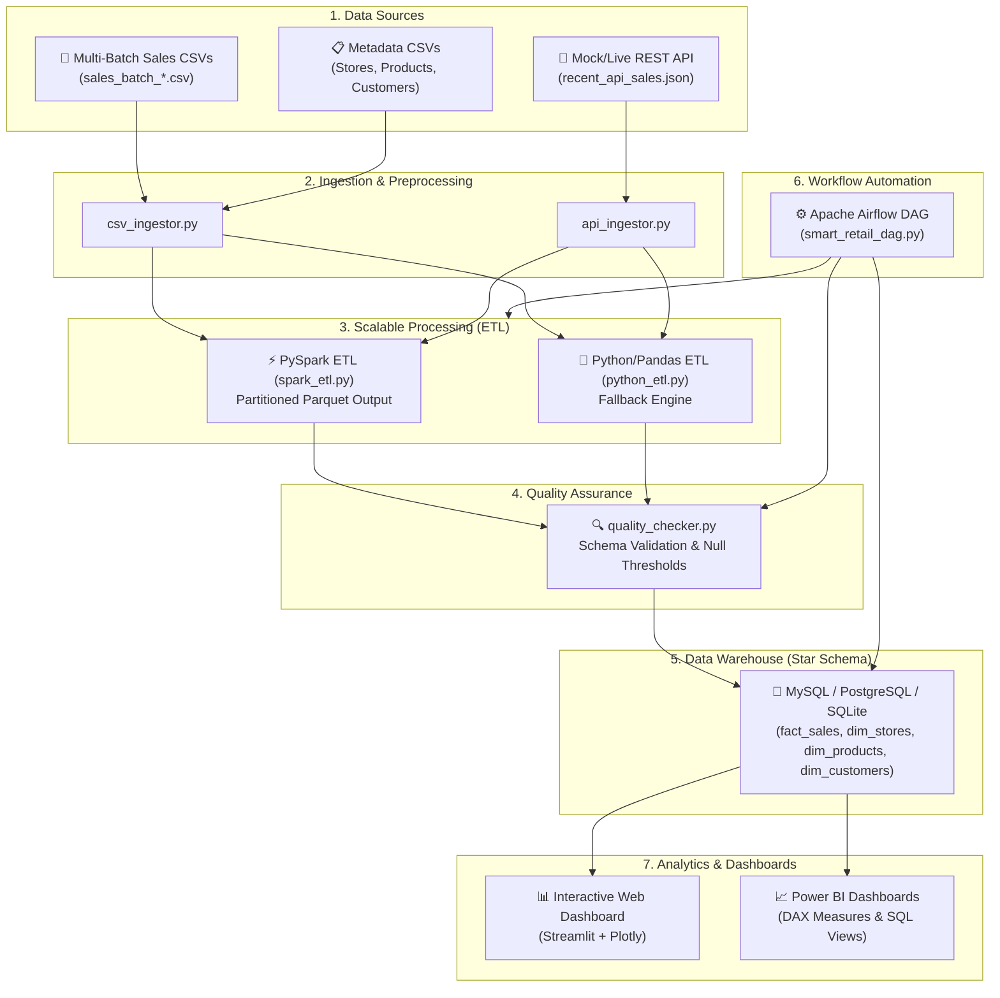

# 🛍️ Smart Retail Sales Data Engineering Pipeline

A production-grade, end-to-end Data Engineering pipeline for collecting, transforming, storing, orchestrating, and visualizing multi-channel retail sales data.

---

## 🏗️ Architecture & Data Flow Diagram



---

## ⭐ Key Features

1. **Multi-Source Data Ingestion**:
   - Ingests batch transaction files across CSVs and JSON REST API streams.
   - Deduplicates transactions and handles missing metadata seamlessly.
2. **PySpark Big Data ETL Engine**:
   - High-performance Apache Spark batch transformation engine.
   - Computes Net Sales, Gross Cost, Gross Profit, and daily aggregations.
   - Outputs partitioned Parquet data for optimized query speeds.
   - Standalone Python/Pandas fallback included for zero-dependency execution.
3. **Data Warehouse Star Schema**:
   - Relational Star Schema DDL for MySQL, PostgreSQL, and SQLite.
   - Dimension tables (`dim_stores`, `dim_products`, `dim_customers`) and `fact_sales`.
   - Analytical database views for instant BI tool connections.
4. **Apache Airflow Workflow Orchestration**:
   - Automated DAG (`smart_retail_dag.py`) scheduling daily execution of Ingestion $\rightarrow$ Spark ETL $\rightarrow$ Quality Checks $\rightarrow$ Database Upload.
5. **Data Quality Framework**:
   - Automated validation of schema, null constraints, record counts, and profit integrity.
6. **Executive Dashboards & Power BI Integration**:
   - **Interactive Web Dashboard**: Streamlit app with glassmorphism UI, KPI cards, interactive charts, and filtering.
   - **Power BI Suite**: Pre-built DAX measures (`dax_measures.dax`), direct SQL queries (`power_bi_queries.sql`), and setup guide (`POWER_BI_GUIDE.md`).
7. **Containerization & CLI**:
   - Multi-container `docker-compose.yml` (Postgres, Airflow, Spark, Web Dashboard).
   - One-command `Makefile` automation interface.

---

## 🛠️ Tech Stack

- **Languages**: Python 3.10+, SQL
- **Big Data Engine**: Apache Spark (PySpark)
- **Orchestration**: Apache Airflow
- **Databases**: MySQL, PostgreSQL, SQLite
- **Dashboarding**: Streamlit, Plotly, Power BI (DAX)
- **Testing**: Pytest
- **Containerization**: Docker, Docker Compose

---

## 🚀 Quick Start Guide

### 1. Installation

```bash
# Clone the repository
git clone <repository_url>
cd "DATA ENGINNER"

# Install Python dependencies
pip install -r requirements.txt
```

### 2. Generate Synthetic Retail Data

Synthesize multi-batch transaction CSVs, dimension metadata, and mock API data:

```bash
python scripts/generate_sample_data.py
```

### 3. Run the ETL Pipeline

Run the PySpark ETL job (or Python fallback ETL):

```bash
# PySpark Execution
python etl/spark_etl.py

# Standalone Python/Pandas Execution
python etl/python_etl.py
```

### 4. Run Data Quality Verification

```bash
python data_quality/quality_checker.py
```

### 5. Load Processed Data into Database Warehouse

```bash
python database/db_loader.py
```

### 6. Launch Interactive Web Dashboard

```bash
streamlit run dashboards/app.py
```

Open your browser at `http://localhost:8501`.

---

## 🧪 Running Automated Unit Tests

Run the test suite using `pytest`:

```bash
pytest tests/
```

---

## 🐳 Docker Deployment

To spin up PostgreSQL and the Web Dashboard using Docker Compose:

```bash
docker-compose -f docker/docker-compose.yml up --build -d
```

---

## 📜 License

This project is licensed under the MIT License.
"# Smart-Retail-Sales-ETL-Pipeline-" 
